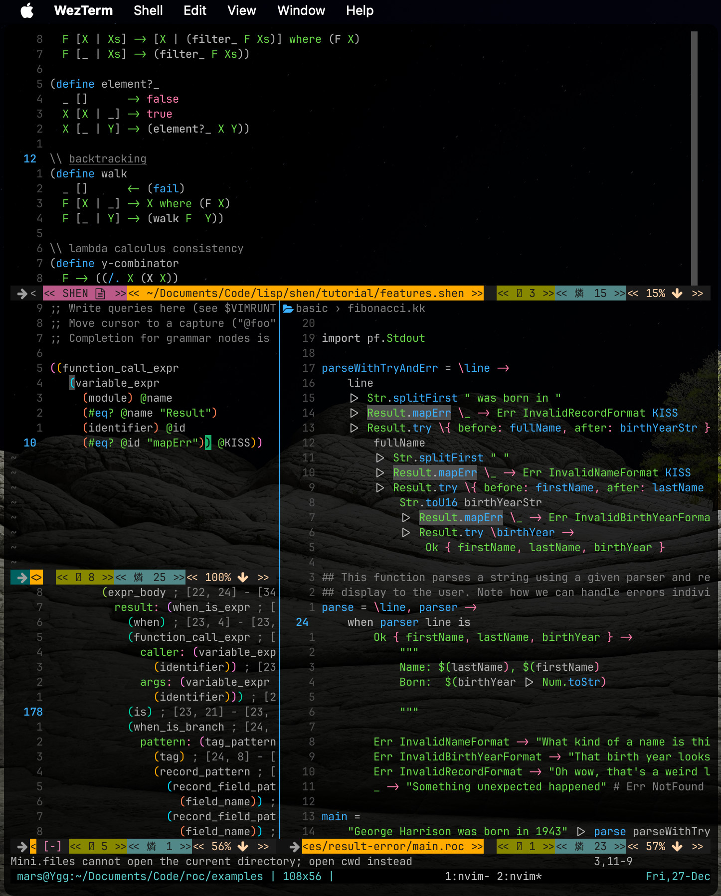

NeoVim
======

- aimed for version 0.11 or 0.10
- tested on version 0.11.1 & 0.10.3-dev for macOS 15.4.1 & Alpine Linux 3.20
  (aarch64 version via [macpine](https://github.com/beringresearch/macpine) & 
  the `community` repository)
- developer guidance:
  - ensure [Tangerine](https://github.com/udayvir-singh/tangerine.nvim) is the latest
    (or at least, after the 09/21/2024 master branch)
    - Fennel 1.5.1 is highly recommended
    - Fennel 1.5.0 is required (probably no `tset` in this setup)

Pre-configuration
-----------------

For the best experience, ensure `rg`, `fzf` & `fd` are installed:

```sh
brew install ripgrep fzf fd
```

Also install a [Nerd version](https://www.nerdfonts.com/) of your favorite
monospaced font for your terminal (I'm happy with ZedMono), otherwise
some emoticons won't be displayed at all.

Showcase
--------



Vim keybinding reminders & tips
-------------------------------

- `"+p`  : paste the system clipboard register
- `<C-6>`/`<C-^>`: switch to the **previously edited file** (**IMPORTANT**:
  use `<C-6>`, not `<C-^>`, on a layout with *dead-keys*; I use an
  international Dvorak layout (+ Command Qwerty) on macOS)
- `:cd` : change the working directory (good for Harpoon; NOTE: `<leader>cd`
  is available to change the working directory **for the current window**
  with `lcd`)
- useful marks (see ShaDa in `:help`):
  - `` `" `` : go to the cursor position when last exiting the current buffer
  - `` `. `` : go to the cursor position where the last change was made
  - `` `' `` : **go to the cursor position of the last jump** (very useful!)
  - `` `0 `` : go to the position before exit 
  - same keybindings as before but `'` instead of the first `` ` `` : go to the
    beginning of the line of a specific cursor position
- `gv`   : recall the latest visual block (say, use `<C-v>` to create one):
  - `I`  : insert in visual block
  - `A`  : append in visual block (use `$` to reach the EOL of each line of
           the block; useful to complete lines with commas or semi-colons)
- `gn` to search forward (`g` as in `ex` command) the `n`ext similar word as
  the last search (`*`, `/\<something\>`...; *since Vim 7.4*):
    - `cgn` to change the current searched word then the next one with the same
      pattern by using `.`
    - `<leader>cc`/`<leader>cgn` to change the current word; you can replace
      the next one with the same pattern by using `.` (*alias* of
      `:let @/=expand('<cword>')<CR>cgn`; **very useful!**)
- `gf`   : **f**etch a file using the filename/hyperlink at the cursor position (it `wget`s an URL)
- `gx`   : `vim.ui.open` a file e**x**plorer/browser using the hyperlink at the cursor position
  (it calls the command `open` on macOS)
- `:map` : check the key mapping
- `:set spell` : enables Vim spellchecking
  - `:set spelllang=FR_fr` (as an example) starts a new dictionary (and download it
    first if not available)
- `<C-f>` : **command mode** after a `:`; behave like any Vim buffer
- navigation with some `z` commands when *wrap* mode is off (default in this setup):
  - `zz`  : center cursor position vertically (**BEWARE**: `ZZ` means save and close buffer; works
            the same when *wrap* mode is on)
  - `z;`  : center cursor position horizontally (added; equivalent to `zszH`; see `remap.fnl`!)
  - `zs`  : scroll horizontally to position the **cursor at the start** of the
            screen
- `G`    : go to the end of file (of course!)
- `J` (in *visual*) : move down the visual block (added; see `remap.fnl`!)
- `<C-j>` : go down in the quickfix list (see below)
- `:copen` : open the quickfix list (say, after a `:grep foo src/*`)
  - *alternative*: `<C-q>` in a Telescope search
- `V:s/foo/bar/g<CR>` : replace *foo* by *bar* in the selection
- `:%s/\(.\)noremap(/vim.keymap.set("\1", <CR>` : replace an old
  `nnoremap` function in standard vim Lua (nice trick!)
- `<C-x><C-l>` (in *insert mode*) : complete the whole line (*ie* find matching lines
  from every buffers and open a selector; navigate *normally* by using `<C-n>`/`<C-p>`;
  confirm with `<C-y>`)
- **Case sensitivity**: the default setting is case insensitive so use `\C`
  to **force the case sensitivity** in a search (eg: `/something\C` or
  `/\Csomething`; use: `\c` otherwise if you've already switched to a
  *case-sensitive setup* with `:set noic`)
- `<C-w>` : window navigation prefix key
  - `!` : kill a **floating window** even if not focused (otherwise, `<C-w><C-w>`
    will get you there eventually)
- useful text/brackets tools:
  - `cs` prefix : `nvim-surround`; modify surrounding brackets and tags; eg:
    - `cs([` : replace a outer block of parentheses by curly brackets
  - `cx` prefix : `vim-exchange`; **swap two words** (very useful!); eg:
    - `cxiw` (on a word) : tag the word for swapping
    - `cxiw` (on a second one) : swap the tagged word and the current one
- **LSP mappings** since 0.11:
  - `grn` : `vim.lsp.buf.rename()`
  - `grr` : `vim.lsp.buf.references()`
  - `gri` : `vim.lsp.buf.implementation()`
  - `gra` : `vim.lsp.buf.code_action()`
  - `<C-S>` (in *insert* and *visual* mode **only**) : `vim.lsp.buf.signature_help()`
    (NOTE: `<C-S>` is mapped to the Harpoon navigation in *normal* mode)
  - `gO` : `vim.lsp.buf.document_symbol()` (NOTE: **check if it doesn't collide
    with the Markdown Outline keybinding**; it was also the default Tangerine's
    `:FnlGotoOutput` before `gG` to show the Lua output file from the current
    Fennel buffer)
  - `[d`/`]d` : move between diagnostics in the current buffer
  - `[D`/`]D` : move to the first/last jump)
- **Netrw** specific:
  - `%` : create file
  - `d` : create directory
  - `gn` : change the current directory to the folder under the cursor
  - `gh` : show/hide hidden files (FIXME: possible conflict!)
- slurping & barfing using the `kovisoft/paredit` plugin for lisp:
  - `<>` : move left the bracket at the current position (as `<leader><`)
  - `><` : move right the bracket at the current position (as `<leader>>`)
  - TIP: use `<M-l>` (`Alt+L` on most systems) to switch back to *normal
    mode* **without moving the cursor back**
  - NOTE: if `julienvincent/nvim-paredit` is activated, you must use:
    - `,@` : splice sexp (unwrap around cursor; `,` is the `<localleader>`)
    - `>)` : slurp forward
    - `>(` : barf backward
    - `>e` : drag element forwards (useful for fennel/clojure pairs between `{}`)
    - `,o`/`,O` : raise form/element
    - **IMPORTANT**: core changes:
      - `W`/`B`  : move to the next/previous head element
      - `E`/`gE` : move to the next/previous tail element (`gE` was the default
      [Tangerine](https://github.com/udayvir-singh/tangerine.nvim) *eval*
      keybinding; it's `gB` in this setup)
- utility commands
  - `:ToggleExec` : toggle the executability of a file (different from the ThePrimeagen's version;
  the previous keybinding `<leader>x` is obsolete)
  - `:ImprintFilename` : imprint the current filename at the cursor position
  - `:ToggleCheckbox` : toggle a checkbox (eg. for a list in a buffer; only works in a *non-empty*
    line; add `- [ ]` at the beginning of the line if no *dash* found there; otherwise,
    add `[ ]` just after the initial *dash*; if `- [ ]`/`- [x]` already exists, replace it by
    `- [x]`/`- [ ]` respectively)
    - use `gt` as a keybinding in a text/markdown file (check the [Cheat sheet](#cheat-sheet)
      subsection)
  - `:ImprintCHeader` (in `cpp`/`h` files) : imprint a C `#include` guard at the current cursor
    position
- *insert* abbrev's:
  - `,\ ` : print a `λ` (can be useful in Fennel code; check `fnl/hondana-dev/set.fnl`)
  - `,,` : print a `_` (there's a 200ms timeout here; it won't collide with `<localleader>`
    keybindings as they are meant for normal mode; can be useful to type `_` without
    the `Shift` key; check `fnl/hondana-dev/remap.fnl`)

Plugins and new keybindings
---------------------------

### Reminders

- **IMPORTANT!**: Lazy is the unique package manager
- the `<leader>` key is `<Space>` in this configuration
- the `<localleader>` key is `,` in this configuration
- `<C-c>` as `<Esc>` (choice made by ThePrimeagen from IntelliJ IDEA)
- Harpoon 2 is *Cwd*-dependent; ensure you start NeoVim at the root of
  your current project (notice you can harpoon a file under the cursor
  in a Netrw or `mini.files` buffer)
- [Which Key](https://github.com/folke/which-key.nvim) is installed;
  it can be deactivated by commenting the related code in the file
  `./fnl/hondana-dev/plugins/init.fnl`
- [sleuth.vim](https://github.com/tpope/vim-sleuth) has been installed but
  won't start unless you manually launch the command `:Sleuth`

### About Netrw

It's great but:
- use `mini.files`:
  - IMPORTANT: `h`/`l` : navigate up/down (`l` on a file = load in buffer)
  - `g?` : help
  - `@`  : reveal `cwd`
  - `=`  : synchronize (IMPORTANT: not :wq)
  - `gh` : show/hide hidden files (FIXME: possible conflict!)
  - edition like `vim-vinegar`/`oil`:
    - btw, `-` is important in a buffer, DON'T TOUCH IT
  - BAD IDEA: don't add `-` as alias of `h` in the `mini.files` buffer
  - Netrw still available: `:Ex` (or open a directory `nvim .`)
- I CANNOT switch to `oil.nvim`
  - `-` in normal mode : open folder directory in `oil.nvim` (like `vim-vinegar`)
  - `<leader>pf`/`<leader>pv` : `mini.files` not `oil.nvim` (instead of `:Ex`)
  - it **BREAKS** Netrw
- `:Ex` is still available

### Example of workflow

- (if persistence) `<leader>qq` : restore the last session
- (locally) `<leader>cd` : change locally the working directory
- `ga` : tag a file in harpoon 2 (first)
- `<leader>pf` or `<leader>pv` : project view at the current directory
  (the cursor is on the current file AKA `:pwd`) or at the current working
  directory (root of the project AKA `:lua print(vim.uv.cwd())`)
  respectively
- make a file, say, a module
  - edit the current buffer from `<leader>pf`
  - `=` to synchronize
  - (optional) otherwise: `%` if you used `:Ex`
- `<C-h>` : back to first file
- (optional) `<C-Space>` : enable completion
- (optional) `<C-y>` : auto-complete a path reference to the newly created module (<C-n>/<C-p> to navigate)
- `gd` (on a reference, say, `require`; normal mode) : back to the module
- `ga` : tag the module in Harpoon 2 (second)
- `gu` : check the harpoon list (change the order with copy-pasta; this was <C-e> is the original configuration)
- `<C-h>`/`<C-t>` : switch back and forth, the file and its module

### Cheat sheet

- `<C-o><cmd>` (in insert): switch to normal to execute `<cmd>` then back to 
insert
- `J` : append line (in normal) BUT in this remap, it doesn't move the cursor away
- `<C-d>`/`<C-u>` : page up/down (doesn't move the cursor in this remap; 
  *memo*: Down/Up)
- `:so` : source this file
- `<C-w><C-w>` : cycle windows
- `<C-w>o` : one window (AKA 'close' others)
- `<leader>cd` : change the working directory for the current window
- in *visual* mode:
  - `<shift-J>`: move down the whole selection
  - `<shift-K>`: move up the whole selection
- *REMINDER*: `:map` to check the key mapping
- `:Lazy` : check package (I prefer this one to Packer)
- `:InspectTree` : display the *Syntax Tree* from Treesitter (neat! it was `:TSPlaygroundToggle` before but
  playground is a part of NeoVim now)
  - `o` (in *Syntax Tree*) : open the *Query Editor* in a *scratch* window to edit
    the Treesitter queries in Scheme (the `:EditQuery` command does it too)
- **IMPORTANT**: `<leader>f` : **format** using [Conform](https://github.com/stevearc/conform.nvim);
- **IMPORTANT!**: `gs` : create a template to replace the *current word*
  (*memo*: `s` as in `:%s`); type `a` (for `all`) to skip the **confirmation** (`<leader>ss`
  was previously used in this case; it's the Telescope *spell suggest* keybinding now)
- `gs` (in visual) : create a template to replace a *pattern
  in the selection*; same confirmation option as above
- `<leader>pf` : `mini.files` at current directory (it was previously `<leader><leader>` but 
  it may *proc* to easily; also *same key twice can be harmful*; *memo*: **p**roject **f**iles)
- **BEWARE:** `<leader>p` (in selection) : paste a buffer but doesn't keep the deleted selection
  so you can paste the same again
- `<leader>pv` : `mini.files` at root (ie *Cwd*; **p**roject **v**iew)
- `<leader>ff>`/`<leader>sf` : Telescope **find files** (replaces `<leader>pf` from a previous setup;
  notice there's `<leader>sF` for Telescope most frequently used files (see *other Telescope keybindings*))
- `<leader>ps` : Telescope project search (`rg`!)
- `<leader>vh` : Telescope view helptags
- `<leader>vv` : Telescope recent files (*memo*: view viewed/**v**iew **v**isited);
  `<leader>vr` is deprecated (poor ergonomics); not in the ThePrimeagen setup
- `<leader>vb`/`<leader>bb` : Telescope buffers (*memo*: view buffers); **doesn't show
  the current one**; not in the ThePrimeagen setup
  - `d` (in *normal* mode) : **d**elete a buffer (added in this setup)
- `<leader>gs` : git status (you can lazy load the FuGITive plugin with the
  command `Git`)
- Harpoon-related keybindings:
  - `ga` : add file in Harpoon (it works with `Netrw` and `mini.files` too; *memo*: **G**et **a**ttached)
  - `gh` : harpoon quick menu (*memo*: **G**o to **H**arpoon; it was `<C-e>` originally)
- `<leader>u`  : undotree
- **VERY IMPORTANT**: `<leader>y`/`<leader>Y`/`<leader>d` : yank or delete for the clipboard
- `<leader>j`/`<leader>k` : quickfix local navigation (ie `lnext`/`lprev`; inverted from ThePrimeagen's)
- `<C-j>`/`<C-k>` : quickfix navigation (ie `cnext`/`cprev`; inverted from ThePrimeagen's;
  more natural; same order as in quickfix/**Trouble**)
- **IMPORTANT (normal mode)**: `<C-p>` : Telescope git files (*memo*: control project)
- `<C-h>` (also `t`,`n`,`s`: dvorak!) : navigate file 1 (2,3,4) in harpoon
- `<C-q>`      : navigate thru tmux sessions (this executable (file)[https://github.com/ThePrimeagen/.dotfiles/blob/master/bin/.local/scripts/tmux-sessionizer] is required in your path)
- **IMPORTANT**: `Q` is removed (in normal mode; avoid typo)
- FuGITive (inside the fugitive buffer only):
  - `<leader>p` : `git push`
  - `<leader>P` : `git pull` **with rebase** 
  - `<leader>t` : `git push -u origin` template; complete with the branch name
    to push to
- LSP case:
  - *cmp_mappings*:
    - `<C-y>` : confirm completion
    - `<C-p>` : previous completion
    - `<C-n>` : next completion
    - `<C-Space>` : complete
    - `<C-f>` : snippet forward selection (navigate thru tmux sessions in normal mode)
    - `<C-b>` : snippet backward selection (unbind `<C-b>` for `tmux`;
      don't use `<C-a>` either because you lose the cursor navigation (start of line);
      `F5`/`fn a` is my current choice for `tmux`)
    - other keys (common in any Vim setup)
      - `<C-e>` : cancel the completion
      - `<C-u>`/`<C-d>` : scroll the document up/down
   - in LSP buffer only (normal mode except when said otherwise)
     - **NOTE**: `<leader>f` will do a `conform.format` or (when unsuccessful) a
       `vim.lsp.buf.format`
     - `<C-s>` (insert mode) : signature (*BEWARE*: `<C-s>` switches to the
       first harpoon in **normal mode**; it was `<C-h>` before; it's the default
       mapping for `vim.lsp.buf.signature_help()` since NeoVim 0.11)
     - `K` : hover (*BEWARE*: `K` moves the selection up in **visual mode**)
     - `gd` : Telescope *builtin*'s **g**oto **d**efinition (**IMPORTANT**: jump to the file in LSP-injected files; say, like lua vim configurations)
     - `gD` : goto declaration
     - `gI` : Telescope *builtin*'s **g**oto **I**mplementation
     - `<leader>vws` : Telescope *builtin*'s **v**iew **w**orkspace **s**ymbol
     - `[d` : next diagnostic
     - `]d` : previous diagnostic
     - `<leader>vtd` : Telescope *builtin*'s **v**iew **t**ype **d**efinition
     - `<leader>vds` : Telescope *builtin*'s **v**iew **d**ocument **s**ymbol
     - these following keybindings come with a shorter version for ergonomics:
       - `<leader>vdd`/`<leader>dd` : **v**iew **d**iagnostic OR simply, **display diagnostic**
         (`<leader>vds` is for document symbols)
       - `<leader>vca`/`<leader>ca` : **v**iew **c**ode **a**ction OR simply, **code action**
       - `<leader>vrr`/`<leader>rr` : Telescope *builtin*'s **v**iew **r**efe**r**ences OR simply, **RefeRences**
         (*BEWARE*: `<leader>r` + another key is used by the *refactoring* plugin; see below)
       - `<leader>vrn`/`<leader>nn` : **v**iew **r**e**n**ame OR simply, **new name**
- **Trouble** (fix helper plugin in `hondana-dev/plugins/quickfix`) case:
  - `<leader>xx` : toggle trouble quickfix (*memo*: quickfiXX)
  - `<leader>xX` : toggle trouble for the current buffer
  - `<leader>cs` : symbols (Trouble)
  - `<leader>cl` : LSP definitions etc... (Trouble)
  - `<leader>xL` : toggle trouble location list
  - `<leader>xQ` : toggle trouble quickfix list
- **Todo-comments** (`TODO`, `FIX`, `WARN`, `NOTE`, `TEST`... highlighter) case:
  - `<leader>]t` : next todo comment
  - `<leader>[t` : previous todo comment
  - NOTE: you can also use the specific commands like `:TodoTelescope`...
- **Treesitter**
  - selection text-objects (prefix with `v` for `visual`, `c` for change, `d` for delete...):
    - `ac`       : *outer* class
    - `am`       : *outer* method/function (**BEWARE**: `f` is for function *call*)
    - `af`       : *outer* function call
    - `aa`       : *outer* argument/parameter
    - `ai`       : *outer* if (it seeks any conditional nodes)
    - `al`       : *outer* loop
    - `a=`       : *outer* assignment
    - for any previous selections, replace the first `a` by `i` for the *inner* version
    - `l=`/`r=`  : LHS/RHS of an assignment
    - `as`       : `@scope`
  - move text-objects (go to...):
    - `]c`       : *next* start *outer* class
    - `]m`       : *next* start *outer* method/function
    - `]a`       : *next* start *inner* argument/parameter
    - `]C`       : *next* end *outer* class
    - `]M`       : *next* end *outer* method/function
    - `]A`       : *next* end *inner* argument/parameter
    - for any previous *moves*, replace the first `]` by `[` for the *previous* version
- Other Telescope keybindings:
  - `<leader>/`  : Telescope search word (**MOST IMPORTANT**; *memo*: `/`)
  - `<leader>sr` : Telescope **resume selections from the previous picker**
  - `<leader>sd` : Telescope **diagnostic**
  - `<leader>sF` : Telescope search the most frequently used files at the root directory
    (using the `frecency` extension; *memo*: **s**earch **F**requently used)
    - NOTE: launch the command `Telescope frecency workspace=CWD`
  - `<leader>sk` : Telescope **s**earch **k**eymaps
  - `<leader>s/` : Telescope **s**earch *live grep* AKA `/` in open files
  - `<leader>sb` : Telescope **s**earch **b**uiltin selector
  - `<leader>sw` : Telescope **s**earch **w**ord (may be deprecated)
  - `<leader>sg` : Telescope **s**earch live **g**rep
  - `<leader>ss` : Telescope **s**pell **s**uggest
  - `<leader>sm` : (only in this setup) Telescope **s**earch live **m**ultigrep (*usage*:
    `<pattern><2-spaces><glob-pattern>`; examples of `<glob-pattern>`: `*.fnl`/`**/plugins/**`)
  - special `stdpath` files:
    - `<leader>en` : Telescope find files to **e**dit amongst the **N**eoVim `config` files
    - `<leader>ep` : Telescope find files to **e**dit amongst the Lazy **p**lugins in your `data`
      path
- Primeagen's refactoring plugin (inspired by Martin Fowler):
  - use `:Refactor e<Tab>` or one of these keybindings (in **selection mode**
    by default):
    - `<leader>re` : extract function
    - `<leader>rf` : extract function to a file
    - `<leader>rv` : extract variable (extract occurences of a selected expression
    to its own variable, replacing occurences of that expression with the variable)
    - `<leader>ri` (also in **normal mode**) : inline variable (opposite of
    extract variable; replace all occurences of a variable with its value)
    - `<leader>rb` (**only in normal mode**) : extract block
    - `<leader>rbf` / `<leader>rbb` (**only in normal mode**) : extract block
      to a file
    - `<leader>rt` : select the *refactor* via Telescope
- [zk](https://github.com/zk-org/zk-nvim) plugin in `hondana-dev/plugins/zettel`:
  - `<leader>z`-based
    [keybindings](https://github.com/zk-org/zk-nvim/blob/main/README.md#example-mappings)
    - global mappings (`<leader>` *+* zn`, `zo`, `zt` & `zf` (incl. visual))
    - markdown-specific keybindings:
      - example: `<leader>znt` in visual : new note using the current selection as title
  - `:ZkNotes` (key: `<leader>zo`) : check your global notebook according to
    your `~/.config/zk/config.toml` if there's no `.zk` in the vicinity
    of the current buffer
  - `<leader>zn`: add a new note from the ```[[<title>]]``` at the current line
  - **(untested)** `<leader>zo`: open Telescope on your zk notebook searching
    the current square-bracketed word at the cursor by default (ie the
    *yanked* text surrounded by any `[ ]`)
- Persistence, a simple session manager (`<leader>q` is the prefix for Persistence):
  - `<leader>qq` : load the session for the current directory
  - `<leader>qs` : select a session to load
  - `<leader>ql` : load the last session
  - `<leader>>qd` : stop Persistence (session won't be saved on exit)
- Github Copilot is ready to use. You must `:Copilot auth` the very first time.
  If Copilot is not loaded, type `:Copilot` or start asking for a suggestion
  with `<C-]>`. Copilot is not auto-triggered by default; type `:CopilotTrigger`
  to do so (NOTE: if the auto-completion menu disturbs you, use `<C-e>` to disable
  the menu and `<C-Space>`, after that, to restore it).  These following
  keybindings are available in **insert mode**:
  - `<M-]>` : next suggestion/start the suggestion (*lazy-load* if not loaded)
  - `<M-[>` : previous suggestion
  - `<C-]>` : accept next word from the suggestion
  - `<C-[>` : cancel the suggestion
  - `<M-=>` : accept the suggestion (**IMPORTANT!**: the default keybinding
    `<M-l>` was reserved in my [yabai](https://github.com/koekeishiya/yabai)
    setup; *memo*: `=` to synchronize as already used in `mini.files`; also,
    `=` is just below `]` on the dvorak layout)
- `gt` (in a text/markdown file) : toggle a checkbox (only works in a *non-empty* line;
  also available in Org mode & `asciidoc` files; check the utility command `:ToggleCheckbox`
  in the [keybindings](#vim-keybinding-reminders-tips) section)
- [Cellular Automaton](https://github.com/Eandrju/cellular-automaton.nvim)
  (setup in `plugins/procrastinate.lua`)
  - `<leader>zz`  : randomly activate an animation

### Technical tips

#### Matchup

[match-up](https://github.com/andymass/vim-matchup) is activated to navigate
and operate on sets of matching text. It extends `%`, supports language
syntax with a Treesitter integration and, displays popup when the matching
element is offscreen. I've had issues with matching parens in my code
with parens inside strings or comments (very stressful in lisp code as
the Fennel source code of this Neovim setup). `matchup` works just fine.

#### Paredit

I choose [paredit](https://github.com/kovisoft/paredit) for Lisp coding over
[nvim-paredit](https://github.com/julienvincent/nvim-paredit) and
[nvim-autopairs](https://github.com/windwp/nvim-autopairs).

- Pros:
  - auto-whitespace before any inner opening bracket (greatly used in Fennel
    & Clojure)
  - smooth deletion
  - electric return to expand the closing parens during edition
    (`vim.lsp.buf.format` to clean up)
- Cons:
  - can lose the tracking (no Treesitter safety)

#### Language Server Protocol

**IMPORTANT**: In this setup, LSP doesn't start on the `BufNewFile` event but on 
the loading of an existing resource in a buffer. This is motivated by the aim of
reducing the startup time of `nvim` alone (try `:StartupTime` as a common benchmark).
Use `:LspStart` to force the LSP launch in the current buffer (say, a *scratch* buffer).

This following technical note naively shows the dependencies and setup of the
lazy loading of `nvim-lspconfig` & `nvim-cmp` in the current NeoVim setup:

```markdown
- LSP
  - neovim/nvim-lspconfig
    - event: BufReadPost
    - cmd: LspStart
    - dependencies:
      - williamboman/mason.nvim
        - run: `:MasonUpdate`
      - hrsh7th/nvim-cmp (see Autocompletion)
      - (optional) rrethy/vim-illuminate (highlight same word)
      - (optional) glepnir/lspaga.nvim (fancy navbar)
    - opts:
      - diagnostics
      - autoformat
      - servers
    - config:
      - requirements
        - cmp_nvim_lsp
          - `default_capabilities(vim.lsp.protocol.make_client_capabilities())` 
        - mason-lspconfig
          - `setup({ ensure_installed = ... })`
        - lspconfig
- Autocompletion (CMP)
  - hrsh7th/nvim-cmp
    - dependencies:
      - hrsh7th/cmp-nvim-lsp
      - L3MON4D3/LuaSnip
        - build: `make install_jsregexp`
      - (optional) rafamadriz/friendly-snippets
      - saadparwaiz1/cmp_luasnip
      - (optional) hrsh7th/cmp-buffer (buffer words)
      - (optional) hrsh7th/cmp-path (filesystem paths)
      - (optional) ray-x/lsp_signature.nvim (show function signatures)
      - (replaced by previous) hrsh7th/cmp-nvim-lsp-signature-help
```

#### Debugger Adapter Protocol

DAP is ready to run. It may be configued for your `lldb-vscode` (soon, `lldb-dap`).
Check `hondana-dev/plugins/dap`. You can: 

- toggle a breakpoint with `<leader>dt` (or `:DapToggleBreakpoint`)
- start debugging with `<leader>dc` (or `:DapContinue`; opens the UI)
- step into with `<leader>di` (or use the UI)
- stop debugging with `<leader>dx` (or `:DapTerminate`; closes the UI)
- (optional) activate a local adapter configuration with `<leader>dN`
  (check [nvim-dap-projects](https://github.com/ldelossa/nvim-dap-projects))

#### Fennel as the main programming language

Fennel code is used to set up this NeoVim. No worries: you still can add your
own plugins written in Lua in `lua/hondana-dev/plugins/unchecked`. Here's the
form of these plugins spec file content:

```lua
-- ~/.config/nvim/lua/hondana-dev/plugins/unchecked/<project-name>.lua
return {
    "<account-name>/<project-name>", -- from github.com
}
```

**IMPORTANT**: If you put your plugins in `lua/hondana-dev/plugins`, please
choose an original filename (say, add your name as a  prefix). If another
plugin spec file with the same name may exist in `fnl/hondana-dev/plugins` 
in the future, the compiled version in `lua/hondana-dev/plugins` would crush
yours.

If you want to edit some Fennel code, notice that:
- the Fennel Language Server should work for diagnostics
- the `<leader>f` keybinding for formatting (ie. `conform.format()`) will
  work if you have the **latest version** of
  [fnlfmt](https://git.sr.ht/~technomancy/fnlfmt) in your `$PATH` (the snippet
  `;skip` prints a special comment if you want to locally skip the formatting)

Here are some keybindings for the Fennel buffer (mainly to access a REPL):
- from the [Tangerine](https://github.com/udayvir-singh/tangerine.nvim) plugin
  (NOTE: `<leader>g` is a prefix for git-related actions (as `<leader>gs` and
  other FuGITive commands); here, `g` followed by a **capital letter** is
  the pattern.):
  - `gL` : **L**ua output
  - `gC` : **C**ompile the file in the current active Fennel buffer into a Lua
    file (this keybinding is not available in the default configuration; don't
    forget to save the file as the compiler doesn't use the current buffer
    itself)
  - (*recent change*) `gG` : **G**o to the Lua file (`:FnlGotoOutput`)
    (**IMPORTANT**: your Fennel files must be in a `fnl/` directory so your
    compiled Lua files will be pushed into a `lua/`-rooted directory tree; to
    move back to the Fennel buffer, remember `<C-6>` is your friend; also, don't
    forget to `gC`/`:FnlCompileBuffer` before `gG`; NOTE: `gO` was the previous
    keybinding but NeoVim 0.11 adds `gO` as the default keybinding for
    `vim.lsp.buf.document_symbol()`)
  - `gB` : **B**uffer evaluation (**IMPORTANT:** it was `gE` before but it
    collides with the Vim core mechanics (*ie* jump backwards to the end of a
    word w/ or w/o punctuation) and/or the *unused for now*
    [paredit](https://github.com/julienvincent/nvim-paredit) by Julien Vincent)
  - `<C-c>` (in the float output buffer) : kill (instead of `<Esc>`) 
- from the [Conjure](https://github.com/Olical/conjure) plugin (NOTE: every
  evaluation is stored in a register, try `"cp`):
  - evaluate: 
    - `<localleader>eb` : **e**valuate the whole **b**uffer
    - `<localleader>ee` : **e**valuate the inn**e**r form
    - `<localleader>er` : **e**valuate the oute**r** form
    - `<localleader>e!` : **e**valuate a form and replace it with the result
    - `<localleader>em<letter>` : **e**valuate a form at the `<letter>` mark
      (created with `m<letter>`)
  - inspect:
    - `<localleader>ew` : inspect by **e**valuating *w*hat it is
    - `<localleader>E` (in visual mode) : inspect by **E**valuating the selection
    - `<localleader>Eiw` (in normal mode) : inspect by **E**valuating the inner word
    - `<localleader>Ea(` (in normal mode) : inspect by **E**valuating the whole parens (`a(`)
  - log buffer:
    - `<localleader>ls` : open the **l**og buffer horizontally **s**plit
    - `<localleader>q`  : close any log buffer (*ie* **q**uit)
    - `<localleader>lr` : soft **l**og **r**eset (leaving the window open)
    - `<localleader>lR` : hard **l**og **R**eset (closing the window open, deleting the buffer)
  - doc word:
    - `<localleader>K`  : doc word (instead of `K`; as used in LSP for hover)

##### LSP server for Fennel

This setup requires [fennel-ls](https://sr.ht/~xerool/fennel-ls/), a language
server for intelligent editing of the Fennel programming language. This script in
*alpha* stage **must be installed manually** (to be up-to-date). 

To setup this language server for your Fennel code inside `~/.config/nvim/fnl/`,
you must run NeoVim at least once (in order to install
[Tangerine](https://github.com/udayvir-singh/tangerine.nvim)), then run the bash
script `./build-project.sh` from the previous directory; this will dump a
`flsproject.fnl` file generated with the correct paths (including the
[Hibiscus](https://github.com/udayvir-singh/hibiscus.nvim) macro path used
in this NeoVim setup).
After this, your next NeoVim session should have a working LSP for Fennel.
As the LSP server is in its early stage, **rerun** `~/.config/nvim/fnl/build-flsproject.sh`
after each [`dotfiles`](https://github.com/martialboniou/dotfiles) update
(I'll improve this step in the future according to the improvements in the language
server).

##### Random tips

Here's some tips for the LISP typists:
- (insert mode) `,\<Space>` : print `λ` (only in this configuration; a viable
  **keyword** in Fennel)
- (insert mode) <C-k> + `*` + `l`: print `λ` (same as above but this is an 
  universal keybinding for Vim/NeoVim)

**Fennel developers**: if you need to compile some fennel codes using
**self-contained libraries** from
[Tangerine](https://github.com/udayvir-singh/tangerine.nvim)
(like [fennel-conditions](https://gitlab.com/andreyorst/fennel-conditions)
or [cljlib](https://gitlab.com/andreyorst/fennel-cljlib)), you must
compile NeoVim using a recent **LuaJit 2.1 with 5.2 compatibility**
enabled (tested with the latest source code in 06/2024).
Otherwise, you'll have to use the `fennel` script manually (this one
uses `lua` by default instead of `luajit`); the resulting code from
`fennel` always works for every `lua` or `luajit` (even the default
non-5.2 version embedded in the stable NeoVim).
My idea is that the table `package.searchers` (or alternative)
is missing from the non-5.2 compatible versions of LuaJit; it is used
by Fennel to do the `doto` trick to import macros from a module.
Check
[this paper](https://andreyor.st/posts/2023-08-27-fennel-libraries-as-single-files)
by Andrey Listopadov for more information.

Notice that for convenience, one of the Tangerine's `fennel.lua` files (normally,
the *latest* one) will be linked to `~/.config/nvim/fnl/fennel.lua`. Delete this
file if you need to update it (the *latest* version is technically a `require`
to another file in the `tangerine/fennel` tree but this setup targets the very last
static file instead and, it won't be the *latest* at some point).
Check `~/.config/nvim/boot.fnl`.

### Note about specific environment for developers

#### Clang (C/C++)

Configure your project by setting a `compile_flags.txt` at the root of your
project like this (change the path according to your install):

```
-Wall
-Wextra
-I/opt/homebrew/include
```

Report to the [documentation](https://clangd.llvm.org/config) for other
settings (say, if you use `cmake`; I generally build by `zig` or other
minimalist scripts).

The default formatting is *annoying* (set to 2 spaces' indent). So, in
this setup, `conform` takes care of `clang-format` instead of the embedded
`clang-format` from `clangd` (the `offsetEncoding` of the LSP protocol
capabilities of `clangd` must be set to `utf-16`): you can pass extra
arguments to `clang-format` easily now (these extra formatting options
were set in `hondana-dev.plugins.null-ls` before).

By default, I recommend you to **copy the file `~/.config/nvim/.clang-format`
to the root of your projects** (assuming `~/.config/nvim` is the root of
your NeoVim setup; type `:echo stdpath("config")` to check this; this file
has been auto-generated and will be again if removed):

```sh
# as an example
cp $HOME/.config/nvim/.clang-format $HOME/Documents/Code
```

If you need a global `clang-format` configuration (and thus **override
every local `.clang-format` files**), set `override-clang-format-globally`
to `true` in `~/.config/nvim/fnl/hondana-dev/plugins/formatters.fnl`: by
doing so, `~/.config/nvim/.clang-format` will be used everytime to
format your *Clang* code.

Here's an example of this current file (check
[the current documentation](https://clang.llvm.org/docs/ClangFormatStyleOptions.html)):

```yaml
BasedOnStyle: LLVM
AlignArrayOfStructures: Right
AlignConsecutiveMacros:
  Enabled: true
  AcrossComments: false
  AcrossEmptyLines: true
BreakBeforeBraces: Custom
BraceWrapping:
  AfterFunction: true
IndentWidth: 4 # depends on your tabstop; here, 4
```

Delete `~/.config/nvim/.clang-format` each time you change your tabstop;
it will rebuild this file with your new setting (you can copy to your
*Clang* projects' root or use it globally if you enabled this option).

One last word about *clangd*: The default LSP semantics in this server
don't fit most colorschemes I used. I decided to remove this part of
the server (thus, the syntax in C, ObjC & C++ is highlighted by using
Treesitter). IMO, the lack of extra tokens in the strings brought by
`clangd` is *no big deal*; the lack of that atrocious parsing for
the CPP/macros is for the best.

#### Symfony 6+ (PHP)

If you want to use this install to make NeoVim as
a *ready-to-go* Symfony editor (and get rid of VSCode), do it so.

First, install with `:Mason` (type `i` when the cursor is above
one of the following package):

- `php-cs-fixer` (not needed if already in your path)
: use `<Space>f` to format your code
- `php-actor` (need a restart): `phpactor.json` auto-created at the root
of the project (start NeoVim there!) and auto-configured after Symfony
was detected. It'll make the editing smooth (autocompletion, auto-imports,
...)

(Optional) For the [Twig](https://twig.symfony.com) template engine:
- `twigcs` diagnostics:
```shell
composer global require friendsoftwig/twigcs
```
- [djLint](https://www.djlint.com/docs/getting-started/) formatter (Python3 required;
NOTE: this was the best way to format Twig properly for me; `conform` uses it by default
for the `twig` filetype):
```shell
pip3 install djlint
```

### Note about the *emoji* completion

The plugin `cmp-emoji` has been added. Type `:` to open the completion menu
anywhere in a **markdown** file or a `git commit` message. This completion is
disabled for other buffers but in comments or strings (ensure there's a space
after the opening `"` before typing the `:`). NOTE: The emoji's completion is
disabled for strings in Fennel code because Treesitter sees symbols (starting
with colon) as strings.
